# RAGFlow Implementation Architecture

## Overview
This document defines the implementation architecture for RAGFlow, adopting a clean architecture pattern with clear layer separation, dependency inversion, and modular design principles. The architecture is designed for terminal-first experience with extensibility for web interfaces.

## Clean Architecture Implementation

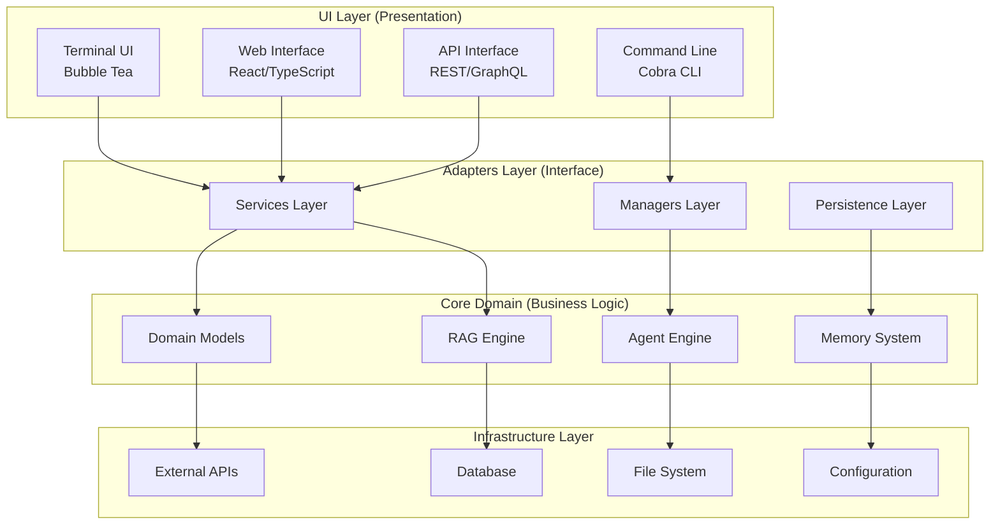

## Layer-by-Layer Implementation

### **UI Layer (Presentation)**

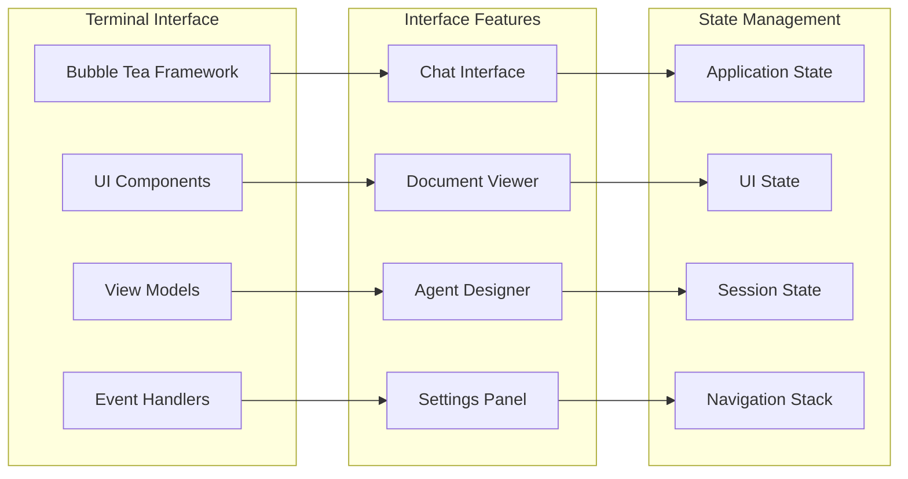

**Key Technologies:**
- **Bubble Tea**: Terminal UI framework for Go
- **Lip Gloss**: Styling and layout for terminal interfaces
- **Cobra**: CLI command framework
- **Viper**: Configuration management

### **Adapters Layer (Interface)**

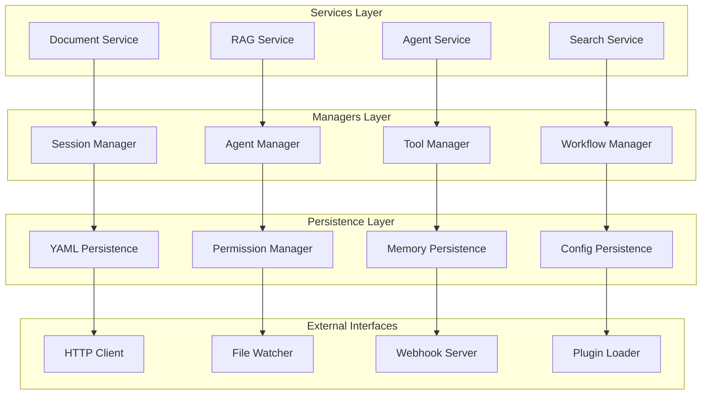

**Key Responsibilities:**
- **Services**: Business logic orchestration and domain model coordination
- **Managers**: Resource management, lifecycle control, and state coordination
- **Persistence**: Data serialization, storage abstraction, and caching
- **External Interfaces**: Third-party integrations and protocol adapters

### **Core Domain (Business Logic)**

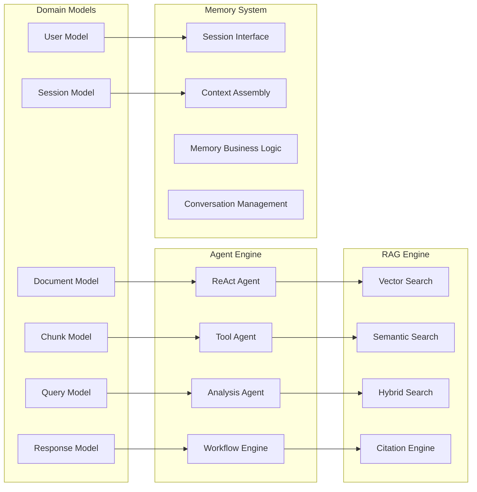

**Domain-Driven Design Principles:**
- **Entities**: Document, User, Session, Agent
- **Value Objects**: Chunk, Query, Response, Citation
- **Aggregates**: Conversation, Workflow, Knowledge Base
- **Domain Services**: Search Engine, Citation Generator, Context Assembler

### **Infrastructure Layer**

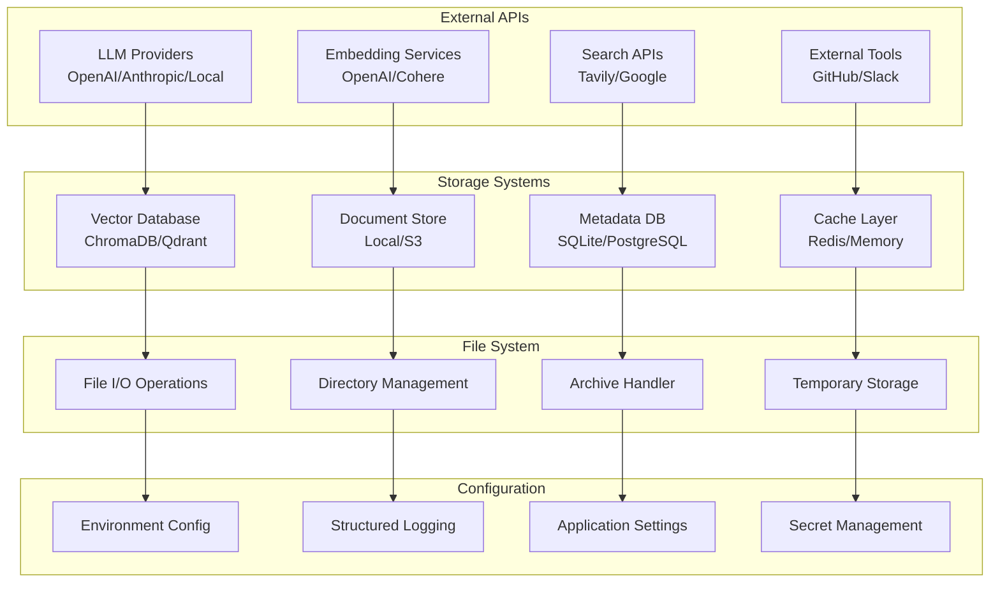

## Technology Stack Implementation

### **Go-Based Core Implementation**

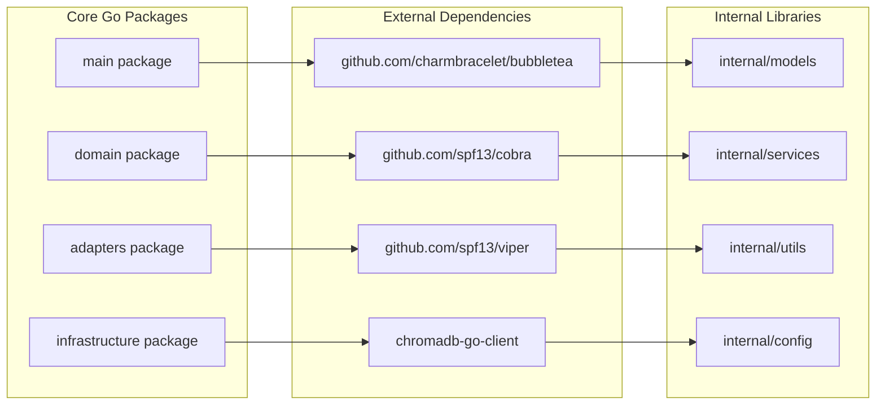

### **Project Structure**

```
ragflow-terminal/
├── cmd/
│   ├── root.go              # Cobra root command
│   ├── chat.go              # Chat interface command
│   ├── agent.go             # Agent management commands
│   └── config.go            # Configuration commands
├── internal/
│   ├── domain/
│   │   ├── models/          # Domain models
│   │   ├── services/        # Domain services
│   │   └── interfaces/      # Port definitions
│   ├── adapters/
│   │   ├── ui/              # Terminal UI components
│   │   ├── services/        # Service implementations
│   │   ├── persistence/     # Data persistence
│   │   └── external/        # External API adapters
│   ├── infrastructure/
│   │   ├── config/          # Configuration management
│   │   ├── logging/         # Logging infrastructure
│   │   ├── storage/         # Storage implementations
│   │   └── clients/         # External service clients
│   └── shared/
│       ├── utils/           # Shared utilities
│       ├── constants/       # Application constants
│       └── errors/          # Error definitions
├── pkg/
│   ├── ragflow/             # Public API package
│   └── agents/              # Agent framework package
├── configs/
│   ├── default.yaml         # Default configuration
│   └── example.yaml         # Example configuration
├── docs/
│   ├── architecture.md      # Architecture documentation
│   └── api.md               # API documentation
├── scripts/
│   ├── build.sh             # Build scripts
│   └── install.sh           # Installation scripts
├── go.mod
├── go.sum
├── Dockerfile
├── docker-compose.yml
└── README.md
```

## Implementation Patterns

### **Dependency Injection Pattern**

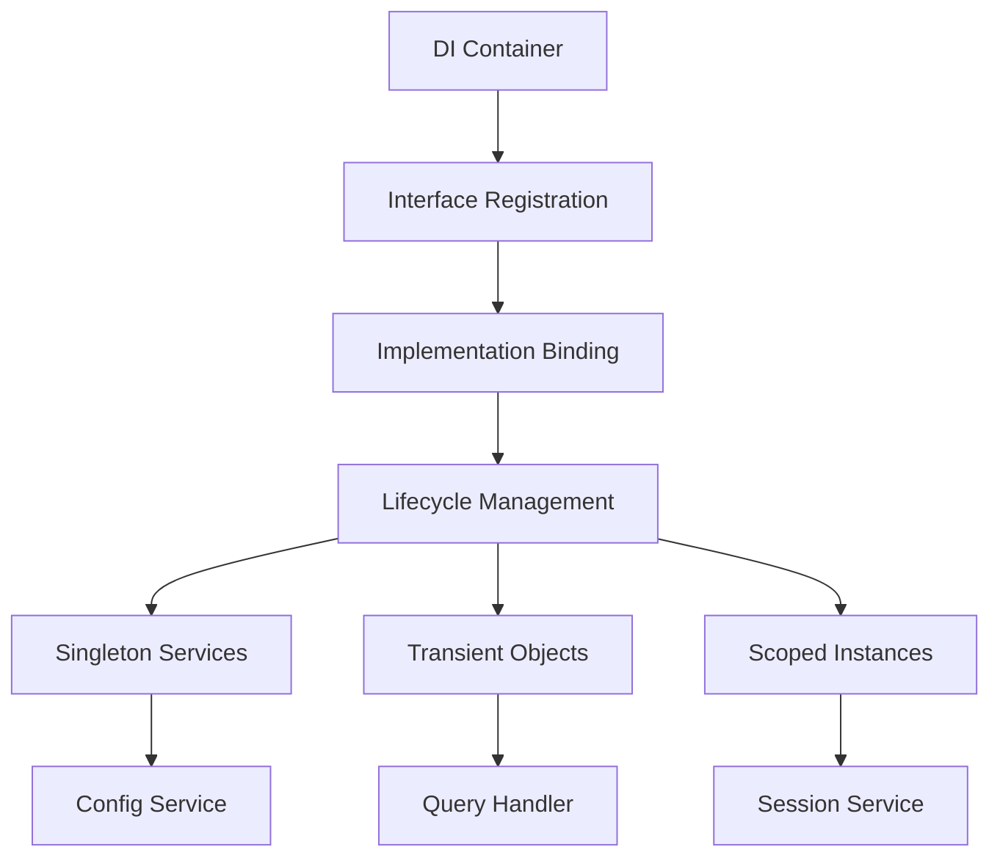

### **Event-Driven Architecture**

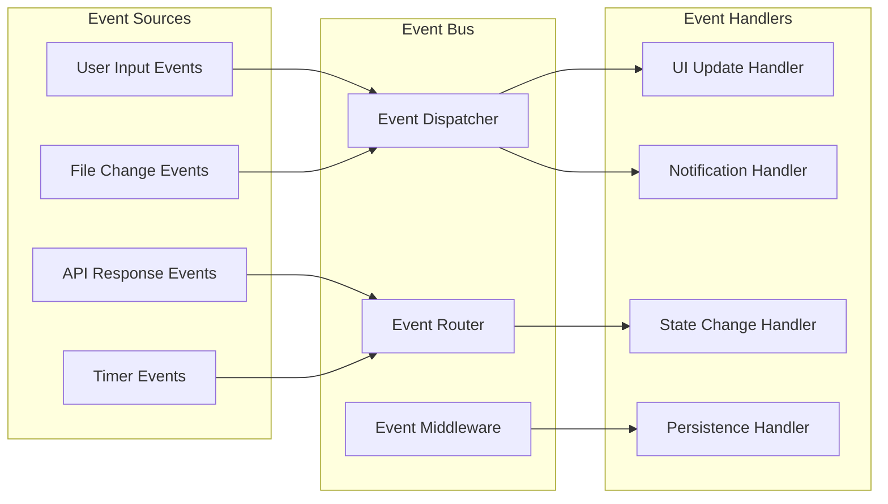

### **Plugin Architecture**

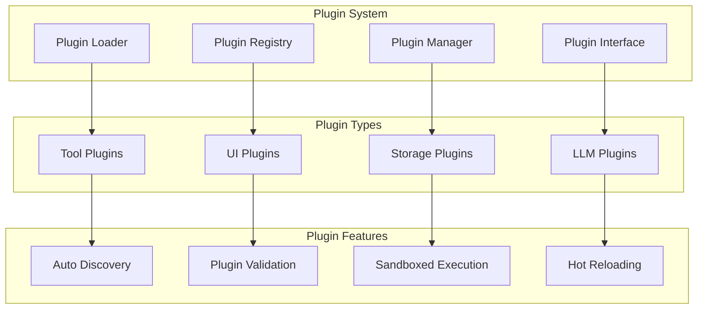

## Data Flow Implementation

### **Request Processing Flow**

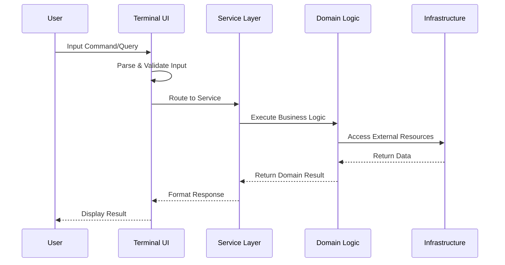

### **Memory Management Flow**

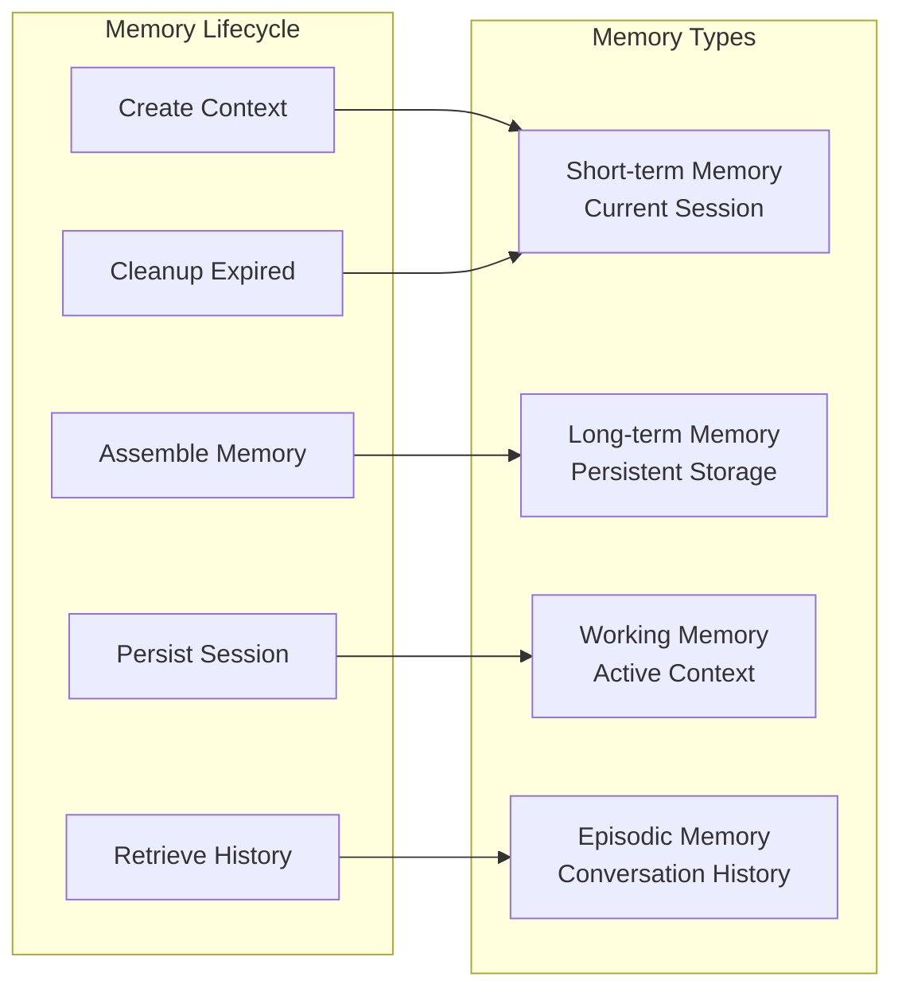

## Error Handling Strategy

### **Error Categories and Handling**

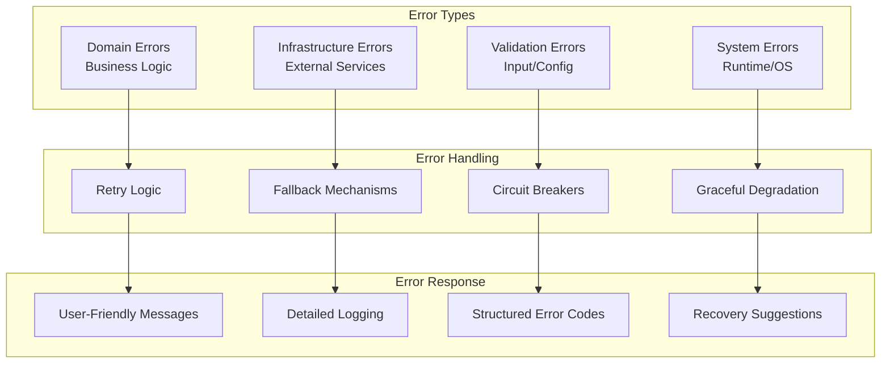

## Testing Strategy

### **Testing Pyramid**

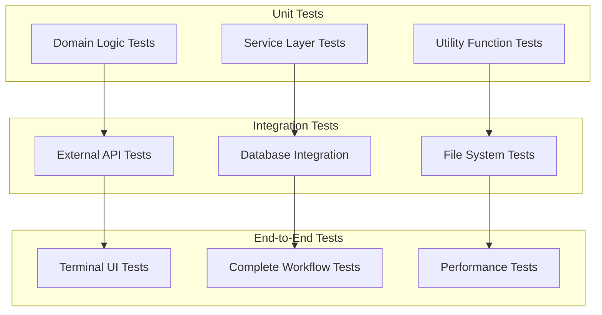

## Key Implementation Principles

### **Clean Architecture Benefits**
- **Independence**: UI, database, and external services are replaceable
- **Testability**: Business logic can be tested without UI or database
- **Framework Independence**: Not tied to specific frameworks
- **Database Independence**: Can switch between different storage solutions

### **Terminal-First Design**
- **Performance**: Fast startup and responsive interaction
- **Accessibility**: Works in any terminal environment
- **Scriptability**: Easy integration with shell scripts and automation
- **Resource Efficiency**: Low memory and CPU footprint

### **Extensibility Points**
- **Plugin System**: Custom tools and integrations
- **Configuration**: Flexible configuration management
- **Themes**: Customizable UI appearance
- **Commands**: Extensible command structure

### **Production Readiness**
- **Logging**: Structured logging with multiple levels
- **Monitoring**: Health checks and metrics collection
- **Configuration**: Environment-based configuration
- **Deployment**: Docker and binary distribution options