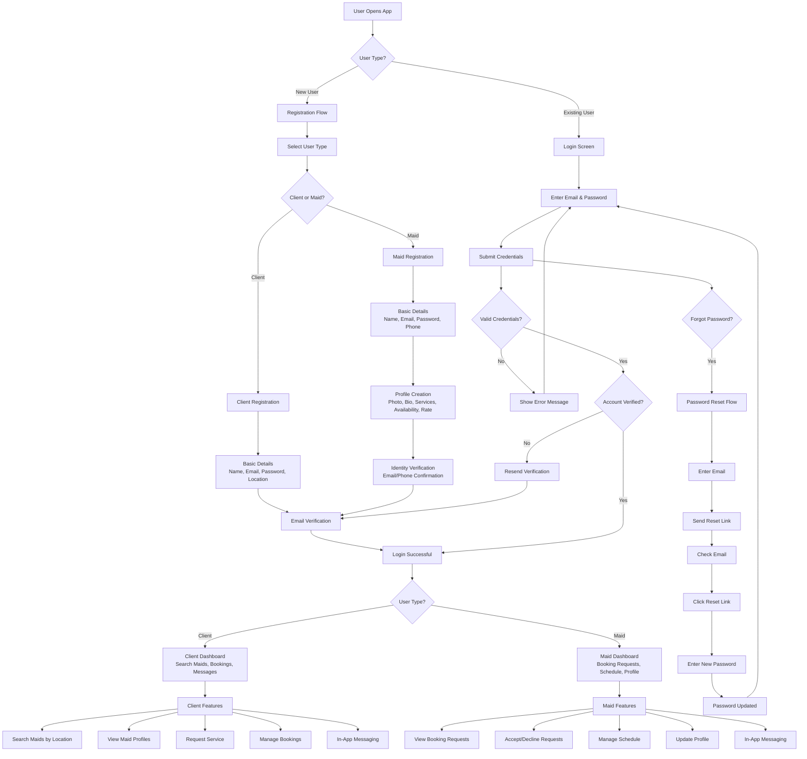

# HydraClean Login Flow Diagram

## Overview
This document outlines the complete login flow for the HydraClean house maid service platform, covering both client and maid user authentication processes.

## Login Flow Architecture

## Detailed Login Flow Components

### 1. Initial App Entry
- User opens the HydraClean mobile app
- System checks for existing authentication tokens
- If authenticated, redirect to appropriate dashboard
- If not authenticated, show login/registration options

### 2. User Registration Flow
- **User Type Selection**: Client or Maid
- **Client Registration**:
  - Basic details: Name, Email, Password, Service Address
  - Email verification required
- **Maid Registration**:
  - Basic details: Name, Email, Password, Phone Number
  - Profile creation: Photo, Bio, Services offered, Availability, Hourly rate
  - Identity verification: Email/Phone confirmation
  - Initial vetting process

### 3. Login Authentication
- **Credential Entry**: Email and password input
- **Validation**: Server-side credential verification
- **Account Status Check**: Verify account is active and verified
- **Error Handling**: Clear error messages for invalid credentials

### 4. Post-Login Routing
- **Client Dashboard**: Search functionality, booking management, messaging
- **Maid Dashboard**: Request management, schedule, profile updates

### 5. Security Features
- **Password Reset**: Secure email-based password recovery
- **Account Verification**: Email confirmation required for account activation
- **Session Management**: Secure token-based authentication
- **Data Protection**: SSL encryption for all communications

## Technical Implementation Notes

### Frontend Components
- Login form with email/password fields
- Registration forms for both user types
- Password reset functionality
- Error message display
- Loading states during authentication

### Backend Services
- User authentication API endpoints
- Email verification service
- Password hashing and validation
- Session management
- User profile management

### Database Schema
- Users table with role differentiation
- Email verification tokens
- Password reset tokens
- User profiles (maid-specific fields)

## User Experience Considerations

### For Clients
- Simple, quick registration process
- Clear value proposition during onboarding
- Easy access to maid search functionality

### For Maids
- Comprehensive profile setup
- Verification process for trust building
- Clear dashboard for managing requests

### Security & Trust
- Transparent verification process
- Clear communication about platform fees
- Secure payment processing integration
- Privacy protection for personal information

## Success Metrics
- Registration completion rate
- Login success rate
- Time to first booking (clients)
- Time to first request acceptance (maids)
- User retention after first week
