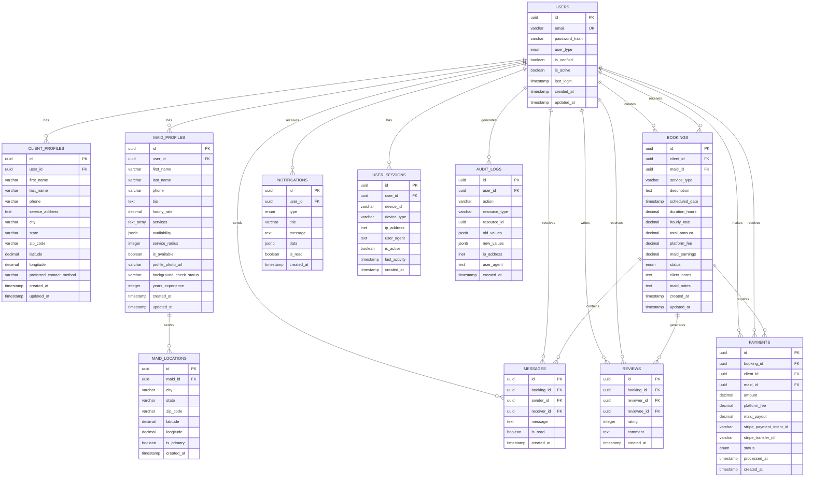
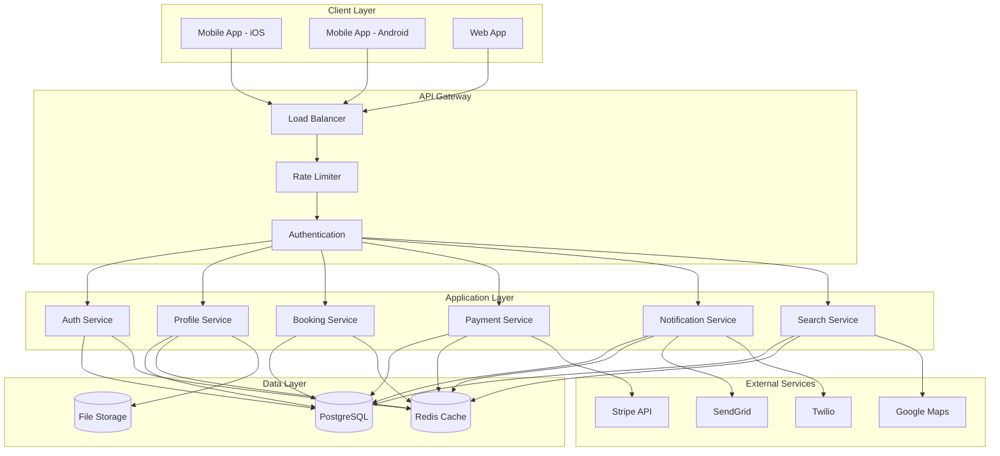
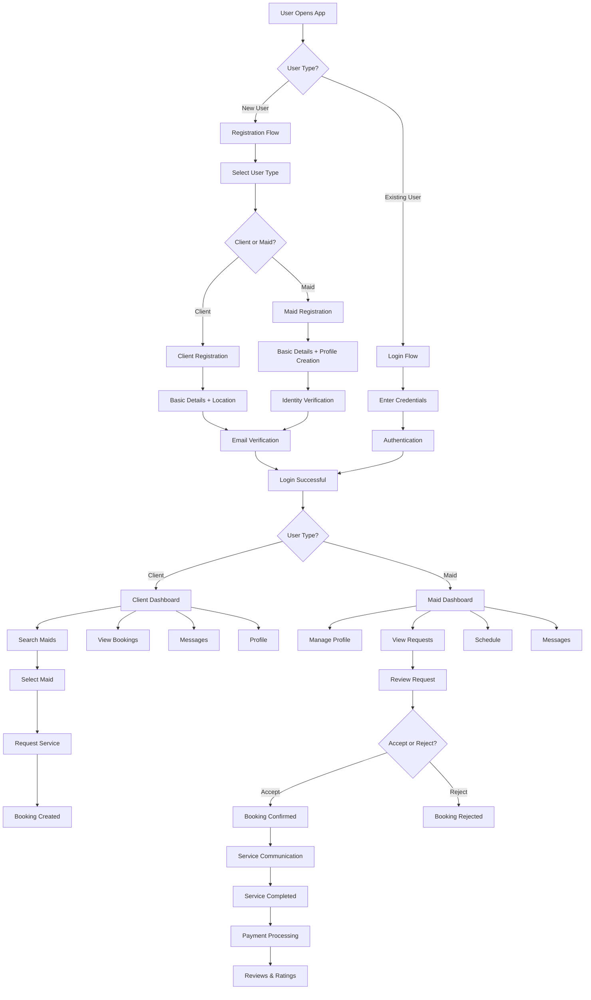
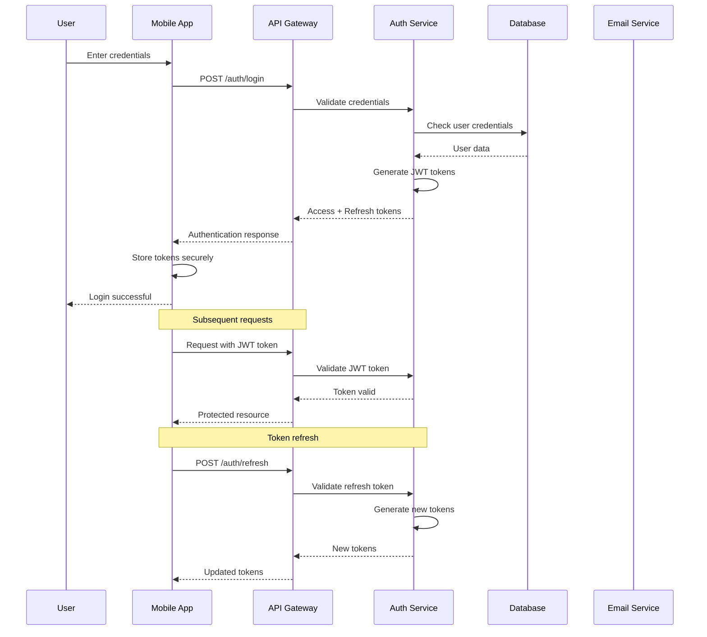
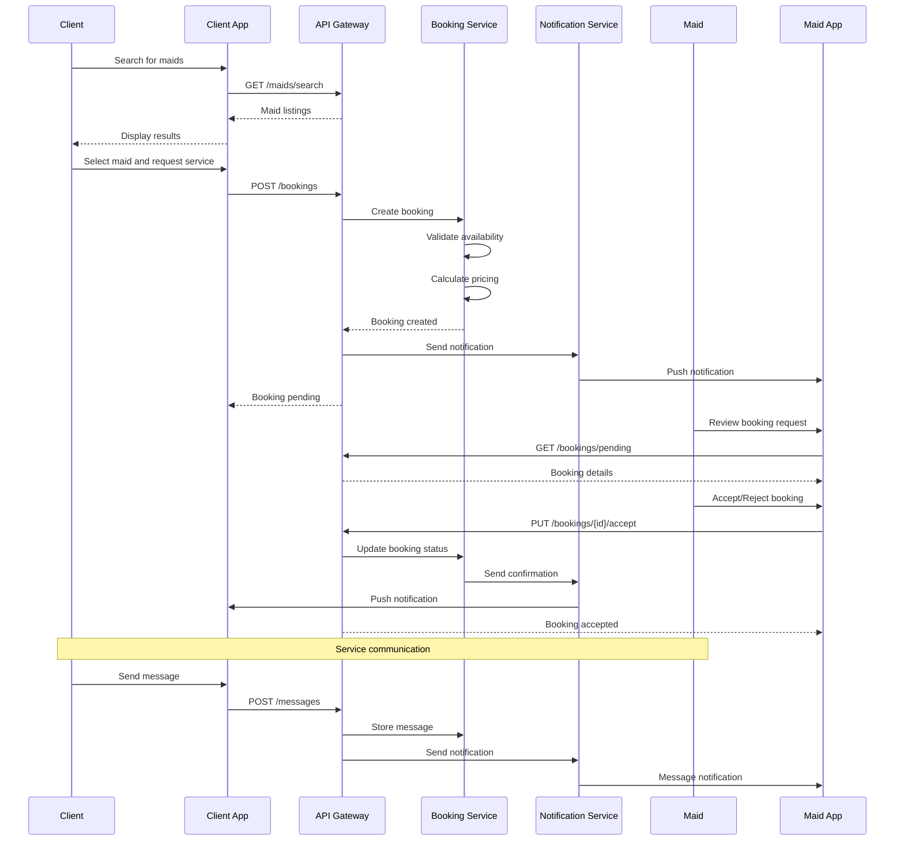
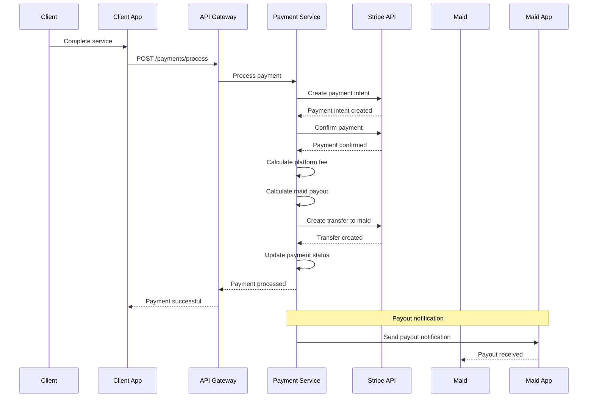
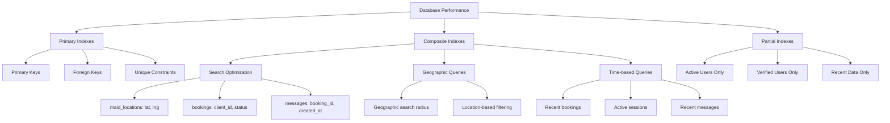
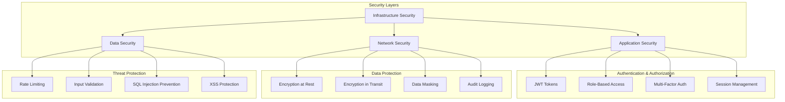
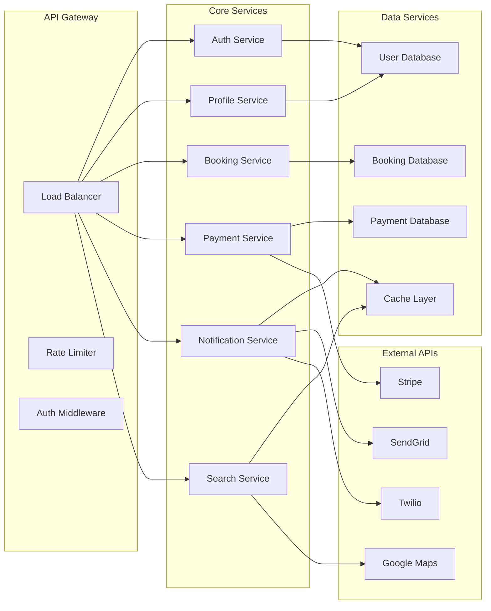
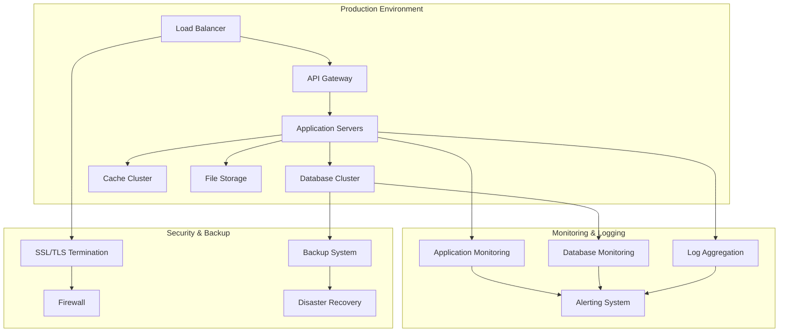

# HydraClean MVP - UML Diagrams

**Version:** 1.0  
**Date:** January 2025  
**Description:** UML diagrams for HydraClean platform architecture

---

## 1. Entity Relationship Diagram (ERD)

---

## 2. System Architecture Diagram

---

## 3. User Journey Flow Diagram

---

## 4. Authentication Flow Diagram

---

## 5. Booking Process Flow Diagram

---

## 6. Payment Processing Flow Diagram

---

## 7. Database Index Strategy

---

## 8. Security Architecture Diagram

---

## 9. Microservices Communication Diagram

---

## 10. Deployment Architecture Diagram

---

**Document Owner:** Technical Architecture Team  
**Review Date:** Weekly  
**Next Review:** End of Week 1
